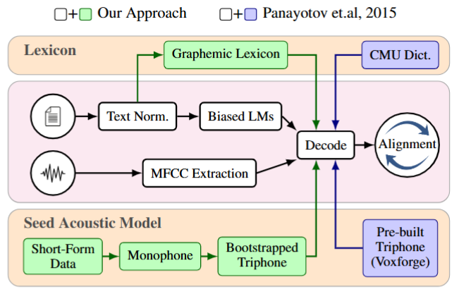

# Endangered Language Datasets

This repository contains speech transcription datasets for five endangered languages, assembled to support the development of automatic speech recognition (ASR) systems using a Kaldi forced-alignment bootstrapping pipeline.
---

## Languages

| Language | Script | Language Family | Region | Estimated Speakers |
|---|---|---|---|---|
| Cornish (Kernewek) | Latin | Brythonic Celtic (Indo-European) | Cornwall, UK | ~600 |
| Hawaiian (ʻŌlelo Hawaiʻi) | Latin | Polynesian (Austronesian) | Hawaiʻi, USA | ~2,000 native; ~24,000 L2 |
| Jejeuo (제주어 Jejueo) | Hangul | Koreanic | Jeju Island, South Korea | ~5,000–10,000 (mostly elderly) |
| Manx (Gaelg) | Latin | Goidelic Celtic (Indo-European) | Isle of Man | ~2,200 |
| Mohawk (Kanienʼkéha) | Latin | Northern Iroquoian | Ontario, Canada and upstate New York, USA | ~3,500 |

All five languages are classified as **endangered or critically endangered** by UNESCO. Cornish became extinct in the late 18th century before being revived in the early 20th century; Manx lost its last native community speaker in 1974 before revitalisation efforts produced a new generation of L2 speakers. Hawaiian, Jejeuo, and Mohawk each retain small but active speaker communities.

---

## Dataset Statistics

Each language is divided into four subsets. **train-ut** (utterance-train) is derived from long-form recordings via forced alignment and automatic segmentation; **train-sh** (short-train) comes from pre-existing short utterance resources; **test-id** is a held-out in-domain evaluation set; **test-ood** is an out-of-domain evaluation set drawn from independent sources. 

| Language | Subset | Utterances | Duration (h) |
|---|---|---:|---:|
| **Cornish** | train-ut | 16,550 | 38.73 |
| | train-sh | 433 | 0.14 |
| | test-id | 131 | 0.28 |
| | test-ood | 37 | 0.09 |
| | **Total** | **17,151** | **39.24** |
| **Hawaiian** | train-ut | 8,815 | 13.86 |
| | train-sh | 702 | 0.26 |
| | test-id | 516 | 0.78 |
| | test-ood | 64 | 0.13 |
| | **Total** | **10,097** | **15.03** |
| **Jejeuo** | train-ut | 2,164 | 3.31 |
| | train-sh | 266 | 0.11 |
| | test-id | 126 | 0.19 |
| | test-ood | 38 | 0.02 |
| | **Total** | **2,594** | **3.63** |
| **Manx** | train-ut | 8,882 | 11.96 |
| | train-sh | 3,215 | 1.70 |
| | test-id | 1,139 | 1.01 |
| | test-ood | 134 | 0.15 |
| | **Total** | **13,370** | **14.82** |
| **Mohawk** | train-ut | 1,512 | 2.08 |
| | train-sh | 1,956 | 2.67 |
| | test-id | 92 | 0.11 |
| | test-ood | 130 | 0.25 |
| | **Total** | **3,690** | **5.11** |
| **All languages** | | **46,902** | **77.83** |

Each language directory also contains a `train-long/` subdirectory holding the original long-form recordings used as the alignment source. These are not included in the statistics above.

Per-language metadata is stored in `{Language}/metadata.csv` with columns:
`id, subset, start_sec, end_sec, duration_sec, transcript_raw, source, audio_url`

---

## How to Use

### Transcripts and metadata only (GitHub)

The transcripts, metadata, and processing scripts are available from our GitHub repository. Audio files are not included due to size constraints.

```bash
git clone https://github.com/[placeholder]/endangered-language-asr
```

### Full dataset with audio

The complete datasets including audio are available from the University of Sheffield Research Data Repository:

> **[Dataset download — University of Sheffield Research Data Repository]**
> [https://doi.org/PLACEHOLDER](https://doi.org/PLACEHOLDER)

### Directory structure

Each language follows a consistent layout:

```
{Language}/
├── metadata.csv              # utterance-level index for all subsets
├── train-sh/                 # short-form training utterances
│   └── {rec_id}/{rec_id}/
│       ├── {rec_id}.wav
│       └── {rec_id}.trans.txt
├── train-ut/                 # long-form-derived training utterances
│   └── {rec_id}/{rec_id}/
│       ├── lbi-{rec_id}-NNN.wav
│       └── {rec_id}.trans.txt
├── train-long/               # source long-form recordings (raw)
│   └── {rec_id}/
├── test-id/                  # in-domain test set
└── test-ood/                 # out-of-domain test set
```

---

## How Were These Datasets Created?

Each dataset was constructed using the same forced-alignment bootstrapping pipeline implemented in Kaldi:



The short-form data (train-sh) provides the seed acoustic model. The document-level language model encodes the known reference transcript to guide decoding back toward the ground truth, producing near-oracle word error rates (typically < 5% at the document level). The resulting word-level CTM alignments are then used to extract precise segment boundaries.

Text normalisation is performed per-language using `local/normalise_text.py`, with language-specific handling of diacritics, apostrophes (phonemic in Hawaiian and Mohawk), colons (vowel length in Mohawk), and script-specific features (Hangul for Jejeuo).

---

## Citation

If you use these datasets in your research, please cite:

> [Authors]. *[Title]*. Interspeech [Year].
> [https://doi.org/PLACEHOLDER](https://doi.org/PLACEHOLDER)
